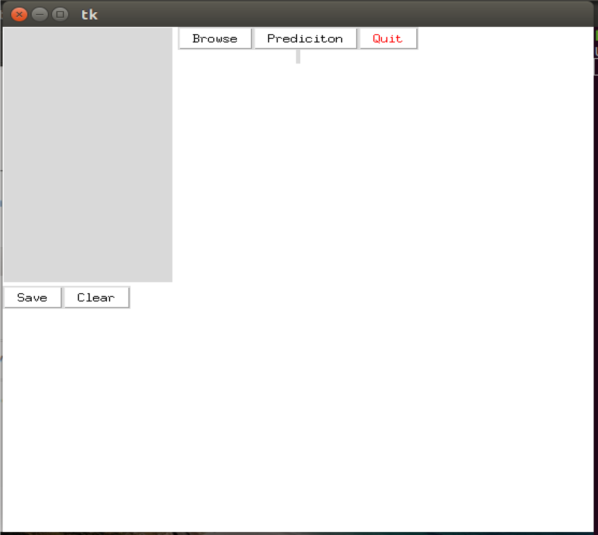
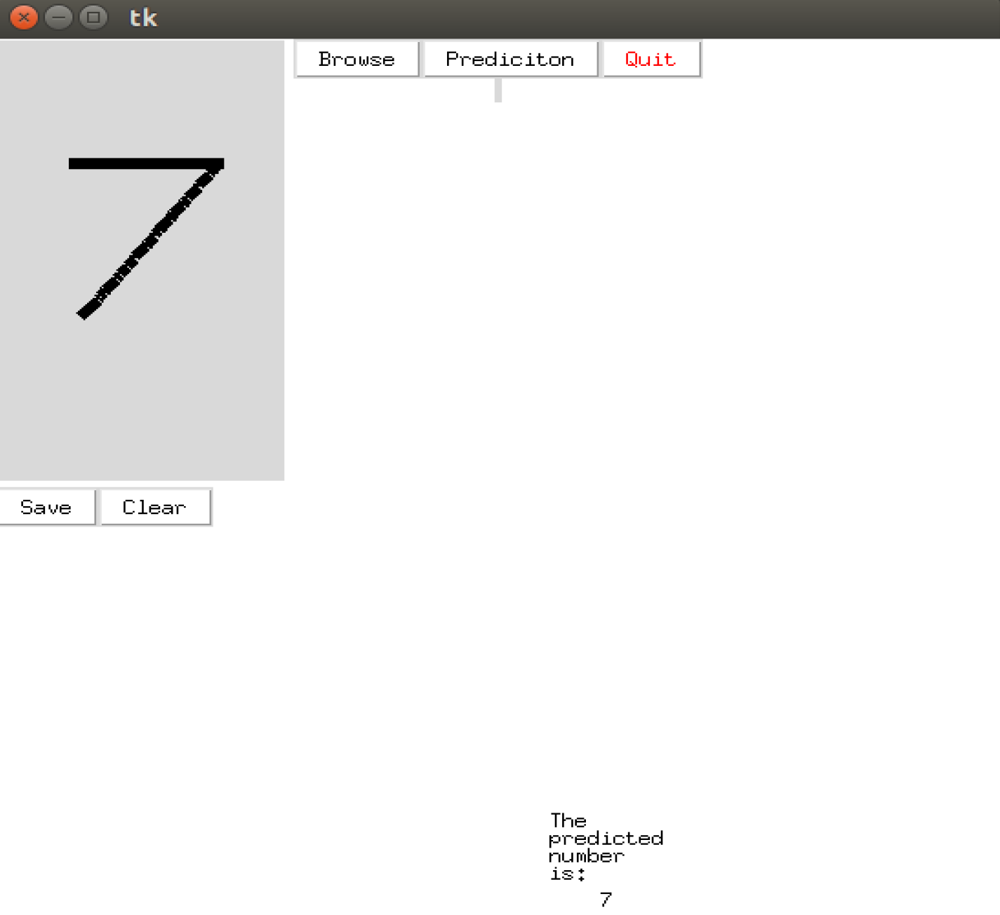

# Digit-recognition-using-Neural-networks

## PROBLEM DEFINITION
Handwritten Digit Recognition is one of the most fundamental problems in designing practical
recognition system. Immediate applications of the digit recognition techniques include, address
code reading, vehicle’s number plate and bank check processing etc

## OBJECTIVES
* To provide an easy user interface to input the object image.
* User should be able to save the image.
* System should be able to pre-process the given input to suppress the background.
* System should recognize digit present in the image and display them to the user.

## [SUPERVISED LEARNING](https://www.mathworks.com/discovery/supervised-learning.html)
It is the machine learning task of inferring a function from labeled training data. The training
data consist of a set of training examples. In supervised learning, each example is
a pair consisting of an input object (typically a vector) and a desired output value (also called
the supervisory signal). A supervised learning algorithm analyzes the training data and produces
an inferred function, which can be used for mapping new examples. An optimal scenario will
allow for the algorithm to correctly determine the class labels for unseen instances. This requires
the learning algorithm to generalize from the training data to unseen situations in a "reasonable"
way.

## [MNIST DATASET](http://yann.lecun.com/exdb/mnist/)
The MNIST problem is a dataset developed by Yann LeCun, Corinna Cortes and Christopher
Burges for evaluating machine learning models on the handwritten digit classification problem.

## [TENSORFLOW](https://www.tensorflow.org/)
TensorFlow is an open source software library for numerical computation using data flow
graphs. Nodes in the graph represent mathematical operations, while the graph edges represent
the multidimensional data arrays (tensors) communicated between them. The flexible
architecture allows you to deploy computation to one or more CPUs or GPUs in a desktop,
server, or mobile device with a single API. TensorFlow was originally developed by researchers
and engineers working on the Google Brain Team within Google's Machine Intelligence
research organization for the purposes of conducting machine learning and deep neural networks
research, but the system is general enough to be applicable in a wide variety of other domains as
well.

## [KERAS](https://keras.io/)
Keras is a high-level neural networks API, written in Python and capable of running on top of
either TensorFlow or Theano. It was developed with a focus on enabling fast experimentation. 
Being able to go from idea to result with the least possible delay is key to doing
good research.

## [TKINTER](https://docs.python.org/3/library/tkinter.html) 
Tkinter is the standard GUI library for Python. Python when combined with Tkinter provides a
fast and easy way to create GUI applications. Tkinter provides a powerful object-oriented
interface to the Tk GUI toolkit.
Creating a GUI application using Tkinter is an easy task. All you need to do is perform the
following steps −
* Import the Tkinter module.
* Create the GUI application main window.
* Add one or more of the above-mentioned widgets to the GUI application.
* Enter the main event loop to take action against each event triggered by the user

## Implementation
**Training**
1. Split the data set into a training set and a test set. Normally the training set is larger than the
test set. Often the desired outputs have to be normalized to the range [0: 1] since the sigmoid
function only returns values in this range. The input patterns do not have to be normalized.
2. Initialize all weights, including all biases if any, to small random values (normally in the range
of -1 to +1).
3. Forward propagation of the first input pattern of the training set from the input layer over the
hidden layer(s) to the output layer, where each neuron sums the weighted inputs, passes them
through the non-linearity and passes this weighted sum to the neurons in the next layer.
4. Calculation of the difference between the actual output of each output neuron and its
corresponding desired output. This is the error associated with each output neuron.
5. Back propagating this error through each connection by using the Backpropagation learning
rule and thus determining the amount each weight has to be changed in order to decrease the
error at the output layer.
6. Correcting each weight by its individual weight update.
7. Presenting and forward propagating the next input pattern. Repeat steps 3-7 until a certain
stopping criterion is reached, for example that the error falls below a predefined value. The one-
time presentation of the entire set of training patterns to the net constitutes a training epoch.

**Testing**
After terminating the training phase the trained net is tested with new, unseen patterns from the
test data set. The patterns are forward propagated, using the weights now available from training,
and the error at the output layer is determined (no weight-update is performed!). If performance
is sufficiently good, the net is ready-for- use. If not, it has to be retrained with the same patterns
and parameters or something has to be changed (e.g. number of hidden neurons, additional input
patterns, different kinds of information contained in the input patterns). It is also important that
the net not be "over trained": if it is trained for too many epochs it starts "memorizing" the
training patterns and can no longer recognize patterns other than those it was explicitly trained
for. This effect can be compared to the over fitting of a discretely sampled function. In summary
the goal of training a neural network is that it is able to generalize. This means that it only
extracts some important features of the data and thus also classifies slightly differing patterns to
belong to the same class. This also provides robustness in the presence of noise

**Preprocessing**
The purpose of preprocessing is to discard irrelevant information in the input data that can
negatively affect the recognition. This concerns speed and accuracy. Preprocessing usually
consists of scaling, binarization, normalization.

**Predication**
The digit in the image is predicted and displayed.

